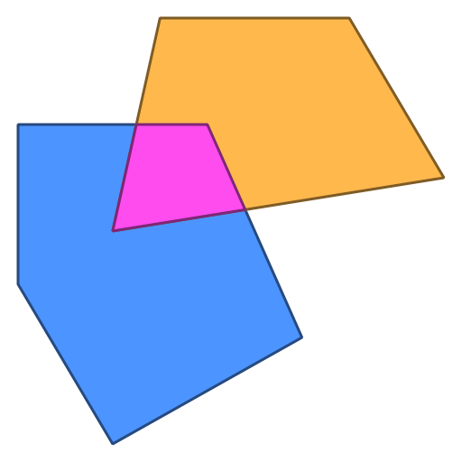
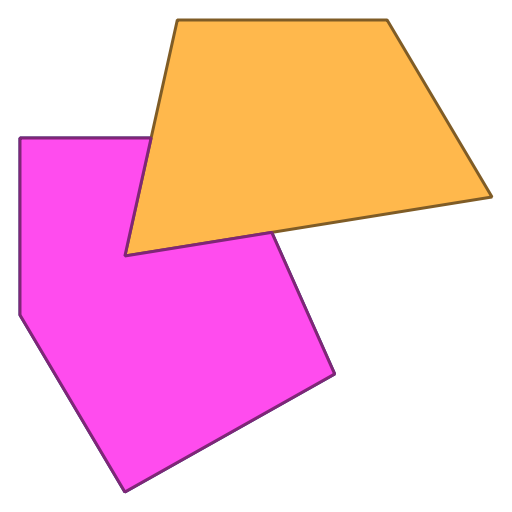
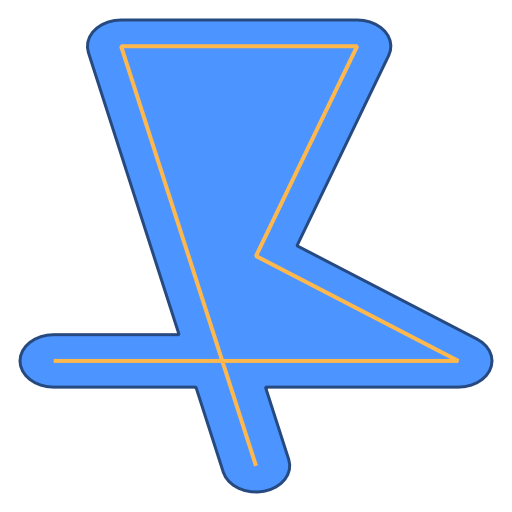

# gogeos - Go library for spatial data operations and geometric algorithms

gogeos is a library for Go that provides operations on spatial data and
geometric algorithms.

It provides bindings to the [GEOS](http://trac.osgeo.org/geos/) C library.

<h2 id="quickstart">Quick start</h2>

```go
package main

import (
	"fmt"
	"log"

	"github.com/paulsmith/gogeos/geos"
)

func main() {
	line, err := geos.FromWKT("LINESTRING (0 0, 10 10, 20 20)")
	if err != nil {
		log.Fatal(err)
	}

	buf, err := line.Buffer(2.5)
	if err != nil {
		log.Fatal(err)
	}

	fmt.Println(buf)
	// POLYGON ((18.2322330470336311 21.7677669529663689, 18.61…
}
```

<h2 id="overview">Overview</h2>

### Functionality

 * Binary predicates - intersects, disjoint, etc.
 * Topology operations - difference, union, etc.
 * Polygonization, line merging, and simplification
 * Prepared geometries (for better performance for common binary predicates)
 * Validity checking
 * DE-9IM
 * Geometry info - area, length, distance, etc.
 * IO - WKT & WKB read/write

gogeos is an open source project (MIT license).

### Community

 * [Source code: GitHub project](https://github.com/paulsmith/gogeos)
 * [Issues tracker](https://github.com/paulsmith/gogeos/issues)
 * [Mailing list: gogeos@googlegroups.com](https://groups.google.com/forum/?fromgroups#!forum/gogeos)
 * [IRC: #gogeos on freenode](irc://irc.freenode.net/gogeos)

<h2 id="installation">Installation</h2>

### Requirements

 * GEOS 3.3.x or greater

GEOS must be installed on your system to build gogeos.

#### Ubuntu

```bash
$ apt-get install libgeos-dev
```

#### OS X - homebrew

```bash
$ brew install geos
```

#### From source (all OSes)

```bash
$ wget http://download.osgeo.org/geos/geos-3.3.8.tar.bz2
$ tar xvfj geos-3.3.8.tar.bz2
$ cd geos-3.3.8
$ ./configure
$ make
$ sudo make install
```

### Installing gogeos

```bash
$ go get github.com/paulsmith/gogeos/geos
```

<h2 id="examples">Examples</h2>

### Binary topology operations

gogeos supports binary topology operations, which produces a new geometry from
a topological operation performed on two input geometries. For example, say we
have these two overlapping polygons, A in blue and B in orange:


*(NB: these graphics weren't produced by gogeos directly - I used the
excellent [draw2d](http://code.google.com/p/draw2d/draw2d) package to render
the output of gogeos functions.)*

Then the following operations will produce new geometries in magenta:

#### Intersection

```go
A.Intersection(B)
```



#### Union


#### Difference (A of B)



#### Difference (B of A)


#### Symmetric difference


### Unary topology operations

gogeos can produce new geometries based on a operation performed on a single
geometry, perhaps with some input. For example, given a linestring, the
`Buffer()` method produces a new polygon:

#### Buffer



### Merging linestrings

For a collection of fully noded linestrings, a new collection can be produced
that merges together the linestrings that touch only at their start and end
points. This is provided by calling the `LineMerge()` method on a
MultiLineString collection:

*Before:*


*After:*


